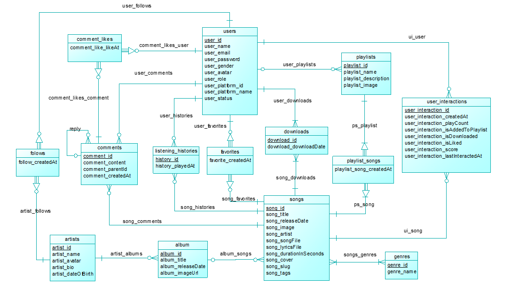

# 🎶 TMusicStreaming

**TMusicStreaming** is a full-featured music streaming backend built with ASP.NET Core and PostgreSQL. It allows users to stream music, manage playlists, interact with songs and artists, and receive personalized recommendations using **User-Based Collaborative Filtering** with **Cosine Similarity**.

---

## 📌 Features

- 🔐 Secure user authentication and roles
- 🎧 Stream and download songs with metadata
- 💬 Comment on songs and reply to others
- ❤️ Favorite, like, and add songs to playlists
- 📜 Track listening history and interactions
- 🤝 Follow artists and other users
- 🤖 Smart song recommendations using **Collaborative Filtering**

---

## 🧠 Recommendation Engine

TMusicStreaming uses **User-Based Collaborative Filtering (UBCF)** to recommend songs based on similar users' preferences.

### 🧮 Cosine Similarity Formula

similarity(A, B) = (A ⋅ B) / (‖A‖ × ‖B‖)

- `A ⋅ B` is the dot product of two user interaction vectors
- `‖A‖` and `‖B‖` are the magnitudes (norms) of the vectors
- Recommend songs liked by users with the highest similarity scores

---

## 🗃️ Project Structure

```
TMusicStreaming/
├── Controllers/         # API endpoints
├── Data/                # DbContext, seeders
├── DataProtectionKeys/  # Keys for cookies, etc.
├── DTOs/                # Request/response structures
├── Helpers/             # Utility functions/constants
├── Migrations/          # EF Core migrations for PostgreSQL
├── Middleware/          # Custom middleware (e.g. logging, exception handling, JWT validation)
├── Models/              # EF Core entity models
├── Repositories/        # Repository pattern interfaces + impl
├── Services/            # Business logic and recommendation logic
├── wwwroot/             # Static files (e.g. song images, covers)
├── appsettings.json     # Configuration (e.g. connection string)
├── Dockerfile           # Docker image definition
├── Program.cs           # Application entry point
├── TMusicStreaming.http # HTTP test scripts
```

---

## 🗺️ ERD (Entity Relationship Diagram)

The following diagram illustrates the relationships between key tables in the PostgreSQL database:



> 📝 The ERD shows users, songs, playlists, artists, and their many-to-many relationships including intermediate linking tables.

---

## 🗄️ Database Schema (PostgreSQL)

| **Table**             | **Fields**                                                                       |
|-----------------------|------------------------------------------------------------------------------------|
| `users`               | `user_id`, `user_name`, `user_email`, `user_gender`, `user_role`                  |
| `songs`               | `song_id`, `song_title`, `song_artist`, `song_tags`, `song_durationInSeconds`     |
| `artists`             | `artist_id`, `artist_name`, `artist_bio`, `artist_dateOfBirth`                    |
| `album`               | `album_id`, `album_title`, `album_releaseDate`, `album_imageUrl`                 |
| `playlists`           | `playlist_id`, `playlist_name`, `playlist_description`, `playlist_image`         |
| `comments`            | `comment_id`, `comment_content`, `comment_parentId`, `comment_createdAt`         |
| `favorites`           | Linking `users` and `songs`                                                       |
| `downloads`           | Songs downloaded by users                                                         |
| `listening_histories` | Songs played by users                                                             |
| `user_interactions`   | `playCount`, `isLiked`, `isAddedToPlaylist`, `isDownloaded`, `score`, timestamps |
| `songs_genres`        | Many-to-Many relation between songs and genres                                    |
| `artist_albums`       | Many-to-Many: artists to albums                                                   |
| `album_songs`         | Many-to-Many: albums to songs                                                     |
| `playlists_songs`     | Many-to-Many: playlists to songs                                                  |
| `follows`             | User-to-user follows                                                              |
| `artist_follows`      | User-to-artist follows                                                            |
| `comment_likes`       | Likes for each comment                                                            |

---

## 🛠️ Tech Stack

| Layer        | Technology                   |
|--------------|------------------------------|
| Backend API  | ASP.NET Core Web API (.NET 8)|
| ORM          | Entity Framework Core        |
| Database     | PostgreSQL (Neon.tech)       |
| Deployment   | Render.com                   |
| Container    | Docker (optional)            |

---

## 🚀 Deployment on Render + Neon.tech

### 🪄 Prerequisites

- GitHub repo with project source code
- PostgreSQL database on [Neon.tech](https://neon.tech)

---

### 1. **Push Your Code to GitHub**

Make sure your project is committed and pushed to a repository.

---

### 2. **Provision PostgreSQL on Neon.tech**

- Go to https://neon.tech and create a PostgreSQL project.
- Copy the **connection string**. Example:
  ```
  Host=ep-xxxxxx.ap-southeast-1.aws.neon.tech;Database=tmusic;Username=neon_user;Password=your_password;SSL Mode=Require
  ```

---

### 3. **Deploy on Render**

- Go to [Render Dashboard](https://dashboard.render.com)
- Click **“New Web Service”**
- Choose your GitHub repo
- Set Environment as: `Docker`
- Add environment variables:

```env
ConnectionStrings__DefaultConnection=Your_Connection_String_From_Neon
ASPNETCORE_ENVIRONMENT=Production
```

> ✅ If you're **not using Docker**, you can also use Render's .NET runtime and specify build/start commands:
>
> - **Build command:** `dotnet build`
> - **Start command:** `dotnet TMusicStreaming.dll`

---

### 4. **Automatic Deploy**

Render will auto-detect changes on your GitHub repo and redeploy.

---

## 🧪 Local Development

```bash
# Apply EF migrations
dotnet ef database update

# Run app
dotnet run
```

### With Docker (local)

```bash
docker build -t tmusic-streaming .
docker run -p 5000:80 tmusic-streaming
```

---

## 🔮 Future Plans

- Add hybrid filtering (UBCF + content metadata)
- Admin CMS for managing artists and songs
- Real-time WebSocket player syncing
- Analytics dashboard (users, songs, popularity)

---

## 📫 Contact

> **Author:** Thinh Huynh 
> **Email:** trthinh2003@gmail.com  
> **GitHub:** [github.com/trthinh2003](https://github.com/trthinh2003)